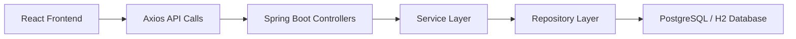

# CampusHire - Job Application and Placement Portal

CampusHire is a Spring Boot + React based placement portal designed as a polished, final-year student project. It helps students create placement-ready profiles, browse job and internship openings, apply to relevant roles, and track application progress. It also gives recruiters a simple dashboard to post jobs, review applicants, and update selection status.

## 1. Project Overview

CampusHire is built to simulate a realistic campus placement workflow without over-engineering the project like a large enterprise system. The application focuses on clarity, clean user flows, and recruiter-friendly presentation.

## 2. Problem Statement

In many colleges, placement activity is handled through scattered forms, emails, and spreadsheets. Students often struggle to maintain a single updated profile and track job applications, while recruiters or placement coordinators need a simple way to publish opportunities and review applicants. CampusHire solves this by bringing both sides into one structured portal.

## 3. Key Features

- Student registration and login
- Recruiter registration and login
- Student profile management with academic and resume details
- Browse job and internship openings
- Filter jobs by role, location, company, skills, job type, and compensation
- View detailed job descriptions
- Apply to a job with duplicate application prevention
- Track application stages from `Applied` to `Selected`
- Recruiter job posting and job management
- Recruiter applicant review and status updates
- Dashboard statistics for students and recruiters
- Responsive and polished UI for laptop and mobile

## 4. User Roles

- `Student`
  Students create profiles, browse openings, apply to jobs, save interesting roles, and track application progress.

- `Recruiter`
  Recruiters create job postings, manage their jobs, view applicants, and update application status.

- `Admin`
  The backend supports an `ADMIN` role for the same management capabilities as recruiters, with broader access if needed.

## 5. Complete Project Flow

### Student Flow

1. Register or log in
2. Complete student profile with branch, graduation year, CGPA, skills, and resume link
3. Browse jobs and internships
4. Use filters to narrow down results
5. Open a job details page
6. Apply to the job
7. Track status updates:
   - Applied
   - Under Review
   - Shortlisted
   - Interview
   - Rejected
   - Selected

### Recruiter/Admin Flow

1. Log in
2. Open recruiter dashboard
3. Create a new job posting
4. View all posted jobs
5. Open applicants for a job
6. Update student application status
7. Monitor dashboard stats such as total jobs, total applications, shortlisted, and selected candidates

## 6. Tech Stack

### Frontend

- React 18
- React Router DOM
- Redux Toolkit
- Tailwind CSS
- Axios
- Lucide React

### Backend

- Spring Boot 3
- Spring Web
- Spring Data JPA
- Spring Validation
- PostgreSQL
- H2 in-memory database fallback for quick local testing
- JWT based token authentication
- Maven

## 7. System Architecture

CampusHire follows a simple layered architecture:

- React frontend for UI and routing
- Axios service layer for API communication
- Spring Boot REST controllers for request handling
- Service layer for business logic
- Repository layer for database access
- PostgreSQL or H2 for persistence



## 8. Backend Modules

- `UserController`
  Handles register, login, and current user endpoints.

- `ProfileController`
  Manages student profile creation and updates.

- `JobController`
  Supports public job listing, job details, recruiter job creation, update, delete, and recruiter-specific job list.

- `ApplicationController`
  Handles job application, student application tracking, recruiter applicant listing, and status updates.

- `DashboardController`
  Returns student and recruiter dashboard statistics.

- `services/*`
  Contains business logic for authentication, profiles, jobs, applications, and dashboards.

- `repositories/*`
  Handles database access through Spring Data JPA.

- `utils/*`
  Includes JWT utility, API exception handling, and global error responses.

## 9. Frontend Pages

- `Home`
  Landing page with project highlights and recruiter-friendly presentation.

- `LoginPage`
  Sign-in page for student and recruiter accounts.

- `SignUpPage`
  Account creation page.

- `FindJobs`
  Browse and filter openings.

- `JobDetails`
  Detailed job description with save and apply actions.

- `StudentDashboardPage`
  Student overview with stats and recent applications.

- `ApplicationsPage`
  Full application tracker view.

- `UserProfilePage`
  Student profile management page.

- `RecruiterDashboardPage`
  Recruiter overview with job and application stats.

- `PostJobPage`
  Create or edit a job posting.

- `PostedJobsPage`
  Manage posted jobs and jump to applicant review.

- `ApplicantsPage`
  View and update applicants for a specific job.

- `AboutPage`
  Project summary and problem statement page.

## 10. Database Models / Entities

### `User`

- `id`
- `name`
- `email`
- `password`
- `accountType`
- `createdAt`
- `updatedAt`

### `Profile` (Student Profile)

- `id`
- `name`
- `email`
- `branch`
- `graduationYear`
- `cgpa`
- `skills`
- `resumeLink`
- `linkedInUrl`
- `githubUrl`
- `headline`
- `about`
- `createdAt`
- `updatedAt`
- linked `user`

### `Job`

- `id`
- `title`
- `company`
- `location`
- `jobType`
- `compensation`
- `requiredSkills`
- `description`
- `deadline`
- `createdAt`
- `updatedAt`
- linked `postedBy`

### `Application`

- `id`
- linked `studentProfile`
- linked `job`
- `status`
- `appliedAt`
- `updatedAt`

## 11. API Endpoint Summary

### Authentication

- `POST /api/auth/register`
- `POST /api/auth/login`
- `GET /api/auth/me`

### Student Profile

- `GET /api/students/profile`
- `PUT /api/students/profile`

### Jobs

- `GET /api/jobs`
- `GET /api/jobs/{id}`
- `GET /api/jobs/mine`
- `POST /api/jobs`
- `PUT /api/jobs/{id}`
- `DELETE /api/jobs/{id}`

### Applications

- `POST /api/applications/jobs/{jobId}`
- `GET /api/applications/mine`
- `GET /api/applications/job/{jobId}`
- `PUT /api/applications/{applicationId}/status`

### Dashboards

- `GET /api/dashboard/student`
- `GET /api/dashboard/recruiter`

## 12. How to Run the Backend

### Option A: Using Maven Wrapper

```bash
cd server
mvnw.cmd spring-boot:run
```

### Option B: Using Maven

```bash
cd server
mvn spring-boot:run
```

By default, the backend can start with an H2 in-memory database for quick testing. You can switch to PostgreSQL by setting the environment variables listed below.

## 13. How to Run the Frontend

```bash
cd client
npm install
npm run dev
```

The frontend runs on:

- `http://localhost:5173`

By default, it expects the backend API at:

- `http://localhost:8080/api`

## 14. Environment Variables Required

### Backend

- `DATABASE_URL`
  Example: `jdbc:postgresql://localhost:5432/campushire`

- `DATABASE_USERNAME`

- `DATABASE_PASSWORD`

- `JWT_SECRET`
  A strong secret key used to sign JWT tokens.

- `JWT_EXPIRATION_MS`
  Optional token expiry in milliseconds.

### Frontend

- `VITE_API_URL`
  Example: `http://localhost:8080/api`

Note:

- If database variables are not set, the backend falls back to H2 for local demo usage.

## 15. Project Structure

```text
Job-Application-System/
├── client/
│   ├── src/
│   │   ├── components/
│   │   ├── pages/
│   │   ├── redux/
│   │   ├── services/
│   │   └── utils/
│   └── package.json
├── server/
│   ├── src/main/java/com/example/kshitiz/server/
│   │   ├── controllers/
│   │   ├── dto/
│   │   ├── entity/
│   │   ├── repositories/
│   │   ├── security/
│   │   ├── services/
│   │   └── utils/
│   └── pom.xml
└── README.md
```

## 16. Screenshots

Add screenshots here after running the project locally:

- `Landing Page` - placeholder
- `Student Dashboard` - placeholder
- `Job Listing Page` - placeholder
- `Job Details Page` - placeholder
- `Application Tracker` - placeholder
- `Recruiter Dashboard` - placeholder
- `Applicants Management Page` - placeholder

## 17. Future Improvements

- Add email notifications for status updates
- Add resume upload instead of resume link only
- Add pagination and sorting for large job lists
- Add company profile pages
- Add interview scheduling workflow
- Add admin analytics and placement reports
- Add automated seed data for demo accounts and job postings

## 18. Resume-Friendly Project Summary

Built `CampusHire`, a full-stack placement portal using `Spring Boot`, `React`, `Redux Toolkit`, `Tailwind CSS`, and `PostgreSQL/H2`. Implemented role-based student and recruiter workflows, job posting and filtering, profile management, application tracking, recruiter dashboards, REST APIs, JWT authentication, validation, and a responsive recruiter-friendly UI suitable for final-year project presentation.
# CampusHire---Job-Application-and-Placement-Portal

# CampusHire---Job-Application-and-Placement-Portal

